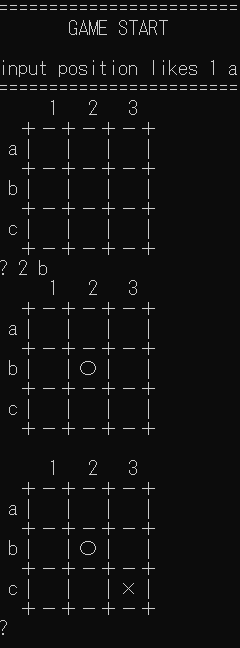

# 課題：強くして
本リポジトリのAIに対して、何らかの工夫をしてください！

* 計算を効率化する
* 新たなアルゴリズムを実装する

5目並べにすると、わかりやすいかもしれません。

# 工夫点

* 【行ったことをここに書く】

# 取り組み方
* 本プロジェクトをforkして、取り組んでください。
* GitHub Actions (Actionsのタブ)を機能させて、README.mdに記述された下記のバッチの「tpu-game-2025」を自分のアカウントに差し替えてください。
* readme.md に実施した工夫を記載してください
* 可能であれば、速度等を計測して、具体的な効率化度合い、強さを示してください。
* 納得できるところまでできたところでプルリクを出してください。

（↑のソースコードの「tpu-game-2025」を自分のアカウント名に差し替えてください（２か所））
